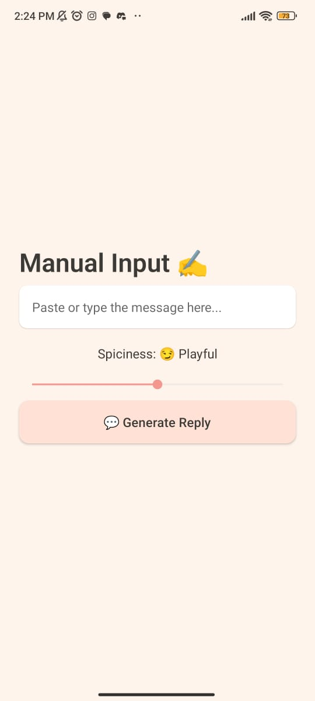
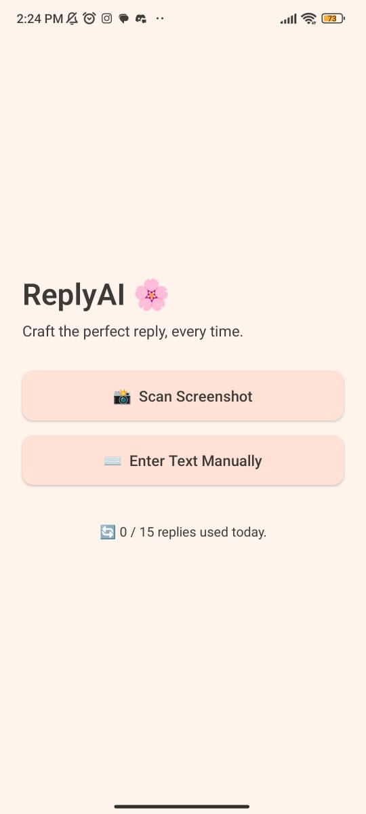
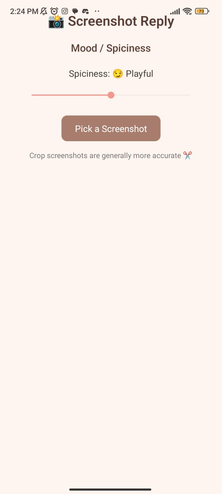

# 
# ReplyAI 💬🔥

> Screenshot-based AI reply generator. Built with React Native and OpenRouter.

Generate smart, spicy, or chill replies from any screenshot. Perfect for playful texting, social finesse, or subtle rizz. Just snap, scan, and reply.

---

## ✨ Features

- 📸 **Screenshot OCR** – Upload a screenshot, extract messages using OCR.
- ✍️ **Manual Text Input** – Or just type the message you want a reply for.
- 🌶️ **Spiciness Slider** – Control how bold or chill the response is.
- 🔄 **Daily Usage Limit** – 15 replies per day to avoid spamming. (AsyncStorage-based)
- 🛠️ **Developer Options** – Reset usage count for local testing.
- ⚡ **OpenRouter API** – Powered by GPT-like models via OpenRouter.

---

## 📲 Download

| Platform | Type       | Link |
|----------|------------|------|
| Android  | APK        | [Download APK](https://github.com/plagzee/reply-ai/releases/latest) |
| iOS      | Coming Soon |  TestFlight |
| Android  | Play Store | TestFlight |


---

## 🚀 Getting Started

### 1. Clone the repo

```bash
git clone https://github.com/yourusername/replyai.git
cd replyai
```

### 2. Install dependencies

```bash
npm install
```

### 3. Add your `.env`

Create a `.env` file at root:

```env
OPENROUTER_API_KEY=your_openrouter_key
OCR_SPACE_API_KEY=your_ocr_space_key
```

### 4. Run with Expo

```bash
npx expo start
```

Scan the QR with Expo Go.

---

## 📷 Screenshots


 

 

---

## 🧰 Tech Stack

- React Native (Expo)
- TypeScript
- OpenRouter API (LLMs)
- OCR via Expo + OCR.space
- AsyncStorage (Usage tracking)

---

## 🔧 Developer Mode

Visit `/dev-options` in the app to reset usage count during development.

---

## 🧠 Credits

- OpenRouter: [https://openrouter.ai](https://openrouter.ai)
- OCR Provider: OCR.Space or APIFlash
- Icons: Phosphor or Lucide
